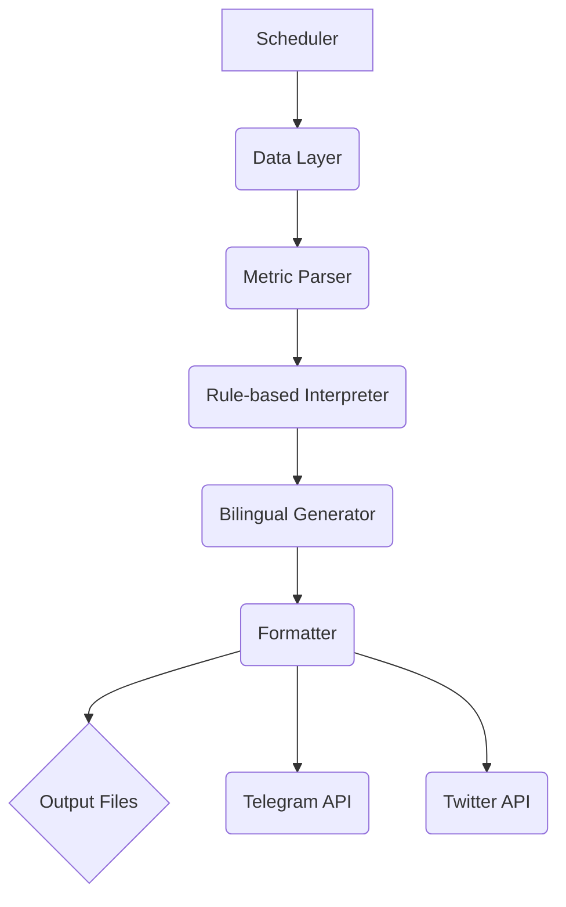

# ARES STRUCTURE ENGINE v1.0

**ARES STRUCTURE ENGINE** is a production-ready, automated content engine designed to generate bilingual (English and Chinese) daily crypto market structure insights. It operates on a principle of pure structural analysis, explicitly avoiding price prediction and market hype. The engine is built with a modular, extensible, and lightweight architecture, making it easy to deploy and maintain on a standard VPS.

**Brand Identity:** Ares Structure Intelligence
**Framework Line (EN):** We read structure, not candles.
**Framework Line (CN):** 我们读结构，不读K线。

---

## 1. System Architecture

The engine is composed of several independent modules that form a sequential pipeline. This design ensures separation of concerns, making the system easy to test, debug, and extend.



### 1.1. Scheduler Logic (`ares/scheduler`)

The **Scheduler** is the entry point for daily execution. It determines which content type to generate based on the day of the week.

- **Functionality**: Detects the current day (1-7, Monday=1) and selects the corresponding content theme from a predefined 7-day rotation schedule.
- **Override**: Supports a `FORCE_DAY` environment variable to manually override the day for testing or specific generation needs.
- **Timezone**: Operates on a configurable timezone (defaulting to UTC) to ensure consistent daily runs.

**7-Day Content Cycle:**
| Day | Theme                   |
|-----|-------------------------|
| 1   | Open Interest + Funding |
| 2   | ETF Flow                |
| 3   | Liquidation Map         |
| 4   | Whale Movement          |
| 5   | Stablecoin Supply       |
| 6   | Orderbook Void          |
| 7   | Weekly Summary          |

### 1.2. Data Layer (`ares/data`)

The **Data Layer** is responsible for fetching raw market data. It features a dispatcher that can switch between mock data for testing and live data from real APIs.

- **`mock_provider.py`**: Generates deterministic, realistic mock data for all 7 content types. The data is seeded with the date, ensuring that runs for the same day produce the same raw data, which is crucial for testing.
- **`live_provider.py`**: A stub module where real API calls to services like Coinglass, Glassnode, or DefiLlama would be implemented. This isolates all external API dependencies.
- **`provider.py`**: A dispatcher that reads the `DATA_MODE` environment variable (`mock` or `live`) and routes the data request to the appropriate provider.

### 1.3. Metric Parser (`ares/parser`)

The **Metric Parser** transforms raw, quantitative data from the Data Layer into qualitative, structured signals. This is a critical step in abstracting raw numbers into meaningful market dynamics.

- **Functionality**: It takes a dictionary of metrics (e.g., `btc_oi_change_pct: -8.5`) and classifies them into directional states (e.g., `oi_direction: 
down`"). It then synthesizes these classifications into a primary `structural_signal`.
- **Output Schema**:
  ```json
  {
    "metric_change": { ... },
    "leverage_shift": "leverage_reset",
    "liquidity_state": "contracting",
    "structural_signal": "leverage_reset"
  }
  ```

### 1.4. Rule-based Structure Interpreter (`ares/rules`)

The **Interpreter** is the analytical core of the engine. It uses a dictionary-based rule set to map the `structural_signal` from the parser to a concise, insightful, and bilingual interpretation.

- **Functionality**: It takes the parsed signal (e.g., `leverage_reset`) and looks it up in a predefined dictionary of over 20 rules.
- **Rules**: Each rule provides a calm, structural, and analytical sentence in both English and Chinese.
- **Extensibility**: Adding new interpretations is as simple as adding a new entry to the `INTERPRETATIONS` dictionary.

**Example Rule:**
```python
"leverage_reset": (
    "Leverage is resetting. Open interest declining with neutral funding indicates forced or voluntary position reduction.",
    "杠杆正在重置。持仓量下降且资金费率中性，表明头寸正在被动或主动缩减。",
),
```

### 1.5. Bilingual Generator (`ares/generator`)

The **Generator** assembles the final content pieces. It combines the interpretation from the rule engine with metric data and brand elements to create a structured, bilingual content object.

- **Functionality**: Creates hooks, metric summary lines, and combines them with the structural insights and brand taglines.
- **Bilingual**: Produces parallel English and Chinese versions for every content element.

### 1.6. Formatter (`ares/formatter`)

The **Formatter** takes the generated content object and tailors it for specific social media platforms, adhering to their character limits and formatting conventions.

- **Twitter/X**: Creates a compact, character-limited (<280) version, prioritizing the English content and key signal.
- **Telegram**: Creates a more detailed, well-structured message using both English and Chinese content, separated by newlines for readability.
- **Token Budgeting**: Includes a lightweight token estimator to ensure the generated content stays within a predefined daily budget (e.g., 800 tokens), a critical feature for managing LLM costs if this engine were extended with a generative model.

---

## 2. Folder Structure

The project is organized into a modular structure that separates the core engine logic, configuration, outputs, and documentation.

```
/home/ubuntu/ares_structure_engine/
├── ares/                     # Core engine source code
│   ├── data/                 # Data providers (mock, live)
│   ├── formatter/            # Output formatters (twitter, telegram)
│   ├── generator/            # Bilingual content generator
│   ├── integrations/         # 3rd-party integrations (Telegram, Twitter)
│   ├── parser/               # Metric parser
│   ├── rules/                # Rule-based interpreter
│   ├── scheduler/            # Day scheduler
│   └── utils/                # Shared utilities (constants, logger)
├── config/                   # (Future use) For rule or config files
├── docs/                     # Documentation and example outputs
├── outputs/                  # Default directory for generated JSON/text files
├── tests/                    # Test suite for the engine
├── .env.example              # Example environment file
├── cron_runner.py            # Cron job entry point
├── main.py                   # Main CLI entry point
├── README.md                 # This documentation file
└── requirements.txt          # Python dependencies
```

---

## 3. Deployment Instructions

The engine is designed for easy deployment on a standard Linux VPS (e.g., Ubuntu 22.04).

### Step 1: Clone the Repository

First, place all the files into a directory on your server, for example, `/opt/ares_structure_engine`.

### Step 2: Install Dependencies

The core engine has **zero external dependencies**. However, for convenience (e.g., loading `.env` files), you can install `python-dotenv`.

```bash
sudo pip3 install -r requirements.txt
```

### Step 3: Configure Environment

Copy the example environment file and customize it.

```bash
cp .env.example .env
```

Edit the `.env` file to set your API keys if you switch to `DATA_MODE=live`. For initial use, `DATA_MODE=mock` is recommended.

**`.env.example`**
```ini
# ============================================================
# ARES STRUCTURE ENGINE v1.0 — Environment Configuration
# ============================================================

# --- Engine Identity ---
ENGINE_NAME=ARES STRUCTURE ENGINE
ENGINE_VERSION=1.0
BRAND_IDENTITY=Ares Structure Intelligence

# --- Scheduling ---
# Override day-of-week for testing (1-7, Mon=1). Leave empty for auto-detect.
FORCE_DAY=
# Timezone for scheduler (IANA format)
TIMEZONE=UTC

# --- Data Layer ---
# Set to "mock" for built-in mock data, "live" for real API endpoints
DATA_MODE=mock

# API keys for live data sources (only needed if DATA_MODE=live)
COINGLASS_API_KEY=
GLASSNODE_API_KEY=
DEFILLAMA_API_KEY=
ETHERSCAN_API_KEY=

# --- Telegram Bot Integration ---
TELEGRAM_BOT_TOKEN=
TELEGRAM_CHANNEL_ID=

# --- Twitter/X Integration ---
TWITTER_API_KEY=
TWITTER_API_SECRET=
TWITTER_ACCESS_TOKEN=
TWITTER_ACCESS_SECRET=

# --- Output ---
OUTPUT_DIR=./outputs
LOG_LEVEL=INFO

# --- Token Budget ---
MAX_TOKENS_PER_DAY=800
```

### Step 4: Manual Test Run

Execute a test run using the main CLI to ensure everything is working correctly. The `--demo` flag is perfect for this.

```bash
python3 main.py --demo
```

This will generate and print the output for all 7 days.

### Step 5: Set Up Cron Job for Automation

For fully automated daily execution, set up a cron job. Open the crontab editor:

```bash
crontab -e
```

Add the following line to run the engine every day at 08:00 UTC and publish the results. Adjust the time and paths as needed.

```cron
0 8 * * * cd /home/ubuntu/ares_structure_engine && /usr/bin/python3 cron_runner.py --publish >> /var/log/ares.log 2>&1
```

This command:
- Runs at 08:00 UTC daily.
- Changes to the project directory.
- Executes the `cron_runner.py` script, which runs the pipeline and publishes.
- Appends all output (stdout and stderr) to a log file for later inspection.

---

## 4. Example Daily Outputs

Below are the full example outputs for all 7 days of the content cycle, as generated by the `main.py --demo` command. These demonstrate the bilingual content, platform-specific formatting, and analytical tone.


```text

╔══════════════════════════════════════════════════╗
║          ARES STRUCTURE ENGINE v1.0          ║
║                                                  ║
║   Automated Bilingual Market Structure Engine    ║
║   We read structure, not candles.                ║
║   我们读结构，不读K线。                            ║
╚══════════════════════════════════════════════════╝


──────────────────────────────────────────────────
  7-Day Content Rotation Schedule
──────────────────────────────────────────────────
  Day 1 (   Monday): Open Interest + Funding
  Day 2 (  Tuesday): ETF Flow
  Day 3 (Wednesday): Liquidation Map
  Day 4 ( Thursday): Whale Movement
  Day 5 (   Friday): Stablecoin Supply
  Day 6 ( Saturday): Orderbook Void
  Day 7 (   Sunday): Weekly Summary
──────────────────────────────────────────────────


════════════════════════════════════════════════════════════
  GENERATING ALL 7 DAYS — DEMO MODE
════════════════════════════════════════════════════════════


━━━━━━━━━━━━━━━━━━━━━━━━━━━━━━━━━━━━━━━━━━━━━━━━━━
  Day 1: Open Interest + Funding
  Signal: leverage_buildup
  Tokens: 125 | Budget: ✓
━━━━━━━━━━━━━━━━━━━━━━━━━━━━━━━━━━━━━━━━━━━━━━━━━━

── Twitter (169 chars) ──
📐 OI + Funding Structure | 2026-02-27

Signal: Leverage Buildup
BTC OI: +9.9% | Funding: 0.0364 (elevated)

We read structure, not candles.
— Ares Structure Intelligence

── Telegram ──
━━━━━━━━━━━━━━━━━━━━
📐 ARES STRUCTURE ENGINE
━━━━━━━━━━━━━━━━━━━━

🔹 OI + Funding Structure | 2026-02-27
🔹 持仓量 + 资金费率结构 | 2026-02-27

📊 BTC OI: +9.9% | Funding: 0.0364 (elevated)
📊 BTC持仓量: +9.9% | 资金费率: 0.0364 (elevated)

🔍 Signal: Leverage Buildup

EN: Leverage is building. Rising open interest with elevated funding signals aggressive positioning. Structure is fragile.

CN: 杠杆正在累积。持仓量上升且资金费率偏高，表明仓位激进。结构脆弱。

━━━━━━━━━━━━━━━━━━━━
📐 We read structure, not candles.
📐 我们读结构，不读K线。
━━━━━━━━━━━━━━━━━━━━

  Saved: ares_2026-02-27_open_interest_funding.json

════════════════════════════════════════════════════════════


━━━━━━━━━━━━━━━━━━━━━━━━━━━━━━━━━━━━━━━━━━━━━━━━━━
  Day 2: ETF Flow
  Signal: distribution
  Tokens: 113 | Budget: ✓
━━━━━━━━━━━━━━━━━━━━━━━━━━━━━━━━━━━━━━━━━━━━━━━━━━

── Twitter (159 chars) ──
📐 ETF Flow Structure | 2026-02-27

Signal: Distribution
BTC ETF Net: $-144M | Streak: 7d outflow

We read structure, not candles.
— Ares Structure Intelligence

── Telegram ──
━━━━━━━━━━━━━━━━━━━━
📐 ARES STRUCTURE ENGINE
━━━━━━━━━━━━━━━━━━━━

🔹 ETF Flow Structure | 2026-02-27
🔹 ETF 资金流结构 | 2026-02-27

📊 BTC ETF Net: $-144M | Streak: 7d outflow
📊 BTC ETF净流: $-144M | 连续7日outflow

🔍 Signal: Distribution

EN: Distribution pattern emerging. ETF outflows coincide with price weakness. Institutional exits are visible.

CN: 分配模式显现。ETF流出与价格走弱同步。机构退出信号可见。

━━━━━━━━━━━━━━━━━━━━
📐 We read structure, not candles.
📐 我们读结构，不读K线。
━━━━━━━━━━━━━━━━━━━━

  Saved: ares_2026-02-27_etf_flow.json

════════════════════════════════════════════════════════════


━━━━━━━━━━━━━━━━━━━━━━━━━━━━━━━━━━━━━━━━━━━━━━━━━━
  Day 3: Liquidation Map
  Signal: long_flush
  Tokens: 117 | Budget: ✓
━━━━━━━━━━━━━━━━━━━━━━━━━━━━━━━━━━━━━━━━━━━━━━━━━━

── Twitter (166 chars) ──
📐 Liquidation Structure | 2026-02-27

Signal: Long Flush
Liquidated: $663M | Long: $367M · Short: $296M

We read structure, not candles.
— Ares Structure Intelligence

── Telegram ──
━━━━━━━━━━━━━━━━━━━━
📐 ARES STRUCTURE ENGINE
━━━━━━━━━━━━━━━━━━━━

🔹 Liquidation Structure | 2026-02-27
🔹 清算结构 | 2026-02-27

📊 Liquidated: $663M | Long: $367M · Short: $296M
📊 清算总量: $663M | 多头: $367M · 空头: $296M

🔍 Signal: Long Flush

EN: Long-side flush complete. Significant long liquidations cleared overleveraged positions. Structure is lighter.

CN: 多头冲洗完成。大量多头清算清除了过度杠杆仓位。结构更轻。

━━━━━━━━━━━━━━━━━━━━
📐 We read structure, not candles.
📐 我们读结构，不读K线。
━━━━━━━━━━━━━━━━━━━━

  Saved: ares_2026-02-27_liquidation_map.json

════════════════════════════════════════════════════════════


━━━━━━━━━━━━━━━━━━━━━━━━━━━━━━━━━━━━━━━━━━━━━━━━━━
  Day 4: Whale Movement
  Signal: dormant_reactivation
  Tokens: 138 | Budget: ✓
━━━━━━━━━━━━━━━━━━━━━━━━━━━━━━━━━━━━━━━━━━━━━━━━━━

── Twitter (189 chars) ──
📐 Whale Flow Structure | 2026-02-27

Signal: Dormant Reactivation
Net flow: -1,002 BTC | Large txns: 25 | Direction: to_wallet

We read structure, not candles.
— Ares Structure Intelligence

── Telegram ──
━━━━━━━━━━━━━━━━━━━━
📐 ARES STRUCTURE ENGINE
━━━━━━━━━━━━━━━━━━━━

🔹 Whale Flow Structure | 2026-02-27
🔹 巨鲸流动结构 | 2026-02-27

📊 Net flow: -1,002 BTC | Large txns: 25 | Direction: to_wallet
📊 净流量: -1,002 BTC | 大额交易: 25笔 | 方向: to_wallet

🔍 Signal: Dormant Reactivation

EN: Dormant coins reactivated. Long-held supply is moving for the first time in years. Structural shift in holder behavior.

CN: 沉睡代币被激活。长期持有的供应首次移动。持有者行为发生结构性转变。

━━━━━━━━━━━━━━━━━━━━
📐 We read structure, not candles.
📐 我们读结构，不读K线。
━━━━━━━━━━━━━━━━━━━━

  Saved: ares_2026-02-27_whale_movement.json

════════════════════════════════════════════════════════════


━━━━━━━━━━━━━━━━━━━━━━━━━━━━━━━━━━━━━━━━━━━━━━━━━━
  Day 5: Stablecoin Supply
  Signal: liquidity_withdrawal
  Tokens: 125 | Budget: ✓
━━━━━━━━━━━━━━━━━━━━━━━━━━━━━━━━━━━━━━━━━━━━━━━━━━

── Twitter (194 chars) ──
📐 Stablecoin Supply Structure | 2026-02-27

Signal: Liquidity Withdrawal
Total: $155.4B | 7d change: -2.40% | Net mint/burn: $+140M

We read structure, not candles.
— Ares Structure Intelligence

── Telegram ──
━━━━━━━━━━━━━━━━━━━━
📐 ARES STRUCTURE ENGINE
━━━━━━━━━━━━━━━━━━━━

🔹 Stablecoin Supply Structure | 2026-02-27
🔹 稳定币供应结构 | 2026-02-27

📊 Total: $155.4B | 7d change: -2.40% | Net mint/burn: $+140M
📊 总量: $155.4B | 7日变化: -2.40% | 净铸造/销毁: $+140M

🔍 Signal: Liquidity Withdrawal

EN: Liquidity withdrawal detected. Stablecoin supply contracting. Capital is leaving the ecosystem.

CN: 检测到流动性撤出。稳定币供应收缩。资金正在离开生态系统。

━━━━━━━━━━━━━━━━━━━━
📐 We read structure, not candles.
📐 我们读结构，不读K线。
━━━━━━━━━━━━━━━━━━━━

  Saved: ares_2026-02-27_stablecoin_supply.json

════════════════════════════════════════════════════════════


━━━━━━━━━━━━━━━━━━━━━━━━━━━━━━━━━━━━━━━━━━━━━━━━━━
  Day 6: Orderbook Void
  Signal: synthetic_depth
  Tokens: 133 | Budget: ✓
━━━━━━━━━━━━━━━━━━━━━━━━━━━━━━━━━━━━━━━━━━━━━━━━━━

── Twitter (184 chars) ──
📐 Orderbook Depth Structure | 2026-02-27

Signal: Synthetic Depth
Bid depth: $119M | Ask depth: $192M | Imbalance: -22.1%

We read structure, not candles.
— Ares Structure Intelligence

── Telegram ──
━━━━━━━━━━━━━━━━━━━━
📐 ARES STRUCTURE ENGINE
━━━━━━━━━━━━━━━━━━━━

🔹 Orderbook Depth Structure | 2026-02-27
🔹 订单簿深度结构 | 2026-02-27

📊 Bid depth: $119M | Ask depth: $192M | Imbalance: -22.1%
📊 买盘深度: $119M | 卖盘深度: $192M | 失衡: -22.1%

🔍 Signal: Synthetic Depth

EN: Synthetic depth detected. Spoofing patterns visible in the order book. Displayed liquidity may not be genuine.

CN: 检测到合成深度。订单簿中可见挂单欺诈模式。显示的流动性可能不真实。

━━━━━━━━━━━━━━━━━━━━
📐 We read structure, not candles.
📐 我们读结构，不读K线。
━━━━━━━━━━━━━━━━━━━━

  Saved: ares_2026-02-27_orderbook_void.json

════════════════════════════════════════════════════════════


━━━━━━━━━━━━━━━━━━━━━━━━━━━━━━━━━━━━━━━━━━━━━━━━━━
  Day 7: Weekly Summary
  Signal: structural_compression
  Tokens: 119 | Budget: ✓
━━━━━━━━━━━━━━━━━━━━━━━━━━━━━━━━━━━━━━━━━━━━━━━━━━

── Twitter (172 chars) ──
📐 Weekly Structure Summary | 2026-02-27

Signal: Structural Compression
OI: -7.6% | ETF: $-796M | Liq: $1014M

We read structure, not candles.
— Ares Structure Intelligence

── Telegram ──
━━━━━━━━━━━━━━━━━━━━
📐 ARES STRUCTURE ENGINE
━━━━━━━━━━━━━━━━━━━━

🔹 Weekly Structure Summary | 2026-02-27
🔹 周度结构总结 | 2026-02-27

📊 OI: -7.6% | ETF: $-796M | Liq: $1014M
📊 持仓量: -7.6% | ETF: $-796M | 清算: $1014M

🔍 Signal: Structural Compression

EN: Structural compression this week. Multiple metrics converging toward neutral. A regime change may follow.

CN: 本周结构压缩。多项指标趋向中性。可能随后发生制度转换。

━━━━━━━━━━━━━━━━━━━━
📐 We read structure, not candles.
📐 我们读结构，不读K线。
━━━━━━━━━━━━━━━━━━━━

  Saved: ares_2026-02-27_weekly_summary.json

════════════════════════════════════════════════════════════

```

---

## 5. Structural Interpretation Rules

The engine contains **20+ rule-based structural interpretations**, organized by content type. Each rule maps a detected signal to a bilingual, non-predictive, structural insight. Below is the complete rule catalog.

| Signal Name | Content Type | English Interpretation (Summary) | Chinese Interpretation (Summary) |
|---|---|---|---|
| `leverage_reset` | OI + Funding | OI declining with neutral funding — position reduction | 持仓量下降且资金费率中性——头寸缩减 |
| `leverage_buildup` | OI + Funding | OI rising with elevated funding — aggressive positioning | 持仓量上升且资金费率偏高——仓位激进 |
| `organic_expansion` | OI + Funding | OI rising with neutral funding — genuine participation | 持仓量上升但资金费率中性——真实参与 |
| `capitulation_flush` | OI + Funding | OI collapsing with negative funding — forced exits | 持仓量暴跌且资金费率为负——强制平仓 |
| `stable` | OI + Funding | No significant leverage shift detected | 未检测到显著杠杆变化 |
| `accumulation` | ETF Flow | ETF inflows with flat price — quiet absorption | ETF流入但价格平稳——静默吸收 |
| `momentum_absorption` | ETF Flow | ETF inflows align with price movement | ETF流入与价格走势一致 |
| `distribution` | ETF Flow | ETF outflows with price weakness | ETF流出与价格走弱同步 |
| `passive_exit` | ETF Flow | ETF outflows with flat price — quiet repositioning | ETF流出但价格平稳——静默调仓 |
| `divergence` | ETF Flow | Flow-price conflict — ambiguous structure | 流量-价格矛盾——结构模糊 |
| `long_flush` | Liquidation | Heavy long liquidations — structure lighter | 大量多头清算——结构更轻 |
| `short_squeeze_reset` | Liquidation | Heavy short liquidations — forced rebalance | 大量空头清算——强制再平衡 |
| `fragile_structure` | Liquidation | Overleveraged — clusters near price | 过度杠杆——集群距价格近 |
| `clean_positioning` | Liquidation | Leverage flushed — structure reset | 杠杆已冲洗——结构重置 |
| `moderate_clearing` | Liquidation | Normal range liquidations | 正常范围清算 |
| `strategic_accumulation` | Whale | Coins to cold storage — supply removed | 代币转入冷钱包——供应撤出 |
| `distribution_pressure` | Whale | Exchange inflows elevated — exits positioning | 交易所流入增加——退出调仓 |
| `dormant_reactivation` | Whale | Long-held supply moving — holder behavior shift | 长期供应移动——持有者行为转变 |
| `neutral_flow` | Whale | No directional movement — equilibrium | 无方向性移动——均衡 |
| `repositioning` | Whale | Significant movement without clear bias | 有显著移动但无明确偏好 |
| `sidelined_liquidity` | Stablecoin | Supply rising but not entering derivatives | 供应上升但未进入衍生品 |
| `liquidity_deployment` | Stablecoin | Supply and OI both rising — capital entering | 供应和持仓量同升——资金进入 |
| `liquidity_withdrawal` | Stablecoin | Supply contracting — capital leaving | 供应收缩——资金离开 |
| `dry_powder_accumulation` | Stablecoin | Minted but undeployed — potential energy building | 已铸造未部署——势能积聚 |
| `stable_liquidity` | Stablecoin | No significant change | 无显著变化 |
| `liquidity_vacuum` | Orderbook | Thinning with imbalance — sharp moves possible | 变薄且失衡——可能剧烈移动 |
| `fragile_depth` | Orderbook | Thinning but balanced — limited absorption | 变薄但平衡——吸收能力有限 |
| `structural_support` | Orderbook | Depth increasing, balanced — foundation strengthening | 深度增加平衡——基础加强 |
| `synthetic_depth` | Orderbook | Spoofing detected — liquidity may not be genuine | 检测到欺诈——流动性可能不真实 |
| `balanced_book` | Orderbook | Adequate and even depth — no anomalies | 深度充足均匀——无异常 |
| `structural_compression` | Weekly | Metrics converging toward neutral | 多项指标趋向中性 |
| `regime_transition` | Weekly | Structural character shifted across dimensions | 结构特征在多维度变化 |

---

## 6. CLI Reference

The `main.py` script provides a full command-line interface for interacting with the engine.

| Command | Description |
|---|---|
| `python3 main.py` | Auto-detect day and run pipeline for today |
| `python3 main.py --day 3` | Force Day 3 (Liquidation Map) |
| `python3 main.py --day 1 --date 2026-03-01` | Force Day 1 with a specific date |
| `python3 main.py --all` | Generate content for all 7 days |
| `python3 main.py --schedule` | Print the 7-day rotation schedule |
| `python3 main.py --demo` | Full demo: print schedule + generate all 7 days with output |

The `cron_runner.py` script is designed for headless, automated execution.

| Command | Description |
|---|---|
| `python3 cron_runner.py` | Run pipeline, save output files only |
| `python3 cron_runner.py --publish` | Run pipeline, save output, and publish to Telegram + Twitter |

---

## 7. Future Integration Guide

### Switching to Live Data

To switch from mock data to live API data, set `DATA_MODE=live` in your `.env` file and implement the corresponding functions in `ares/data/live_provider.py`. Each function must return a dictionary with the same keys as its mock counterpart. Recommended data sources include Coinglass (OI, Funding, Liquidations), Glassnode (Whale Movement, Stablecoin Supply), SoSoValue (ETF Flows), and Kaiko (Orderbook Depth).

### Telegram Bot Setup

1. Create a bot via [@BotFather](https://t.me/BotFather) on Telegram.
2. Add the bot to your target channel as an administrator.
3. Set `TELEGRAM_BOT_TOKEN` and `TELEGRAM_CHANNEL_ID` in `.env`.
4. Run with `--publish` flag or call `publish_daily_content()` programmatically.

### Twitter/X Integration

1. Apply for a Twitter Developer account and create an app with OAuth 1.0a credentials.
2. Install `tweepy`: `pip3 install tweepy`.
3. Implement the `post_tweet()` function in `ares/integrations/twitter_poster.py`.
4. Set all four Twitter environment variables in `.env`.

---

## 8. Design Principles

The ARES STRUCTURE ENGINE is built on several non-negotiable design principles that define its identity and output quality.

**Zero External Dependencies for Core Engine.** The core pipeline (data, parser, rules, generator, formatter, scheduler) runs entirely on the Python standard library. Optional dependencies like `python-dotenv` or `tweepy` are only needed for convenience or publishing integrations.

**No Price Prediction. No Hype.** The engine never uses words like "bullish," "bearish," "moon," "dump," or "pump." It never forecasts a price target. It only describes structural shifts — what the data shows about positioning, leverage, liquidity, and flow.

**Deterministic and Testable.** Mock data is seeded by date, making all outputs reproducible. The test suite validates content quality (no forbidden words), format compliance (character limits), and budget adherence (token counts) for every day of the cycle.

**Bilingual by Default.** Every content element — hooks, metric summaries, structural insights, and brand taglines — is produced in both English and Chinese, ensuring the engine serves a global audience from day one.

---

*Built by Ares Structure Intelligence. We read structure, not candles.*
