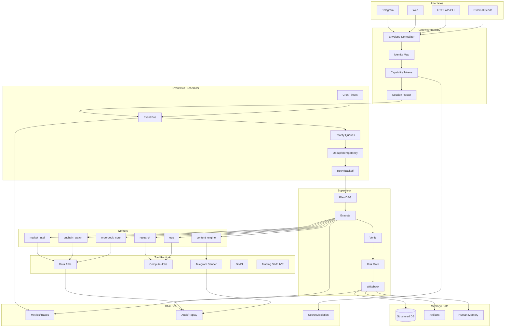
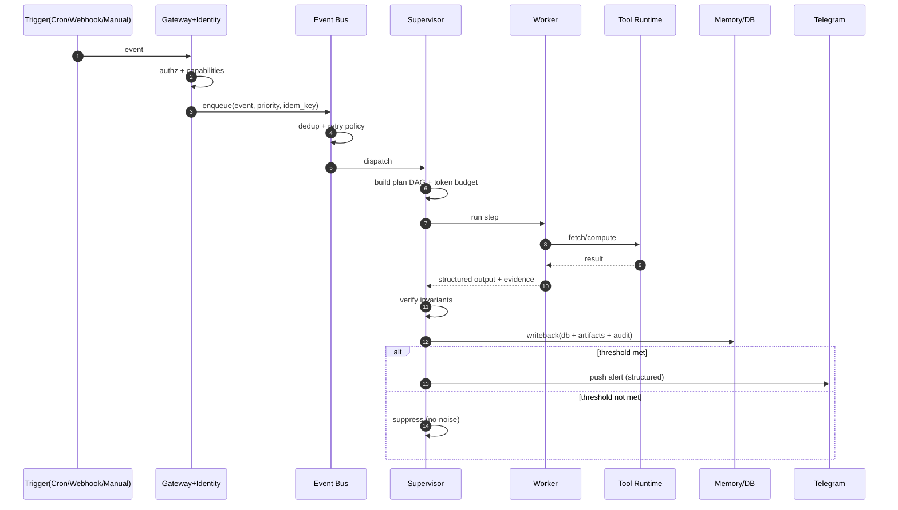
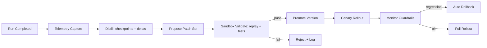

# Ares Infrastructure — vNext (v0.2.1)

## Deliverable 1 — System Overall Architecture (Text Structure)

```text
[L0 Interfaces]
  - Telegram | Web | Discord | HTTP API | CLI
  - External Feeds: Market | Onchain | News | Research

[L1 Gateway + Identity]
  - Envelope Normalizer
  - Identity Map (org/user/workspace)
  - RBAC/ABAC + Capability Tokens
  - Session Router (threading, replay ids)

[L2 Event Bus + Scheduler]
  - Timers/Cron (heartbeat, daily, weekly)
  - Ingest (pollers, webhooks)
  - Queue (priority lanes)
  - Dedup + Idempotency
  - Retry + Backoff

[L3 Supervisor / Orchestrator]
  - Plan Graph Builder (DAG)
  - Execution Runner
  - Verification Layer (invariants/tests)
  - Risk Gate (approval-required ops)
  - Writeback Layer (artifacts + db)

[L4 Digital Employees (Workers)]
  - market_intel
  - onchain_watch
  - orderbook_core
  - research
  - ops
  - content_engine

[L5 Tool Runtime]
  - Data connectors (REST/WS)
  - Compute jobs (python)
  - Messaging (telegram)
  - Code/CI (git)
  - Trading (SIM default; LIVE behind gate)

[L6 Memory + Data Plane]
  - Structured DB: events/snapshots/signals/decisions/audits
  - Human memory: docs/runbooks/daily logs
  - Artifact store: reports/json/pdf

[L7 Observability + Security]
  - Metrics + traces
  - Audit + replay
  - Secret management
  - Isolation (egress policy)
```

---

## Deliverable 2 — Module Relationship Diagram



---

## Deliverable 3 — Execution Flow Diagram (Plan→Execute→Verify→Writeback)



---

## Deliverable 4 — Autonomous Evolution Loop Diagram



---

## Deliverable 5 — Version + Upgrade Notes

### v0.2.1
- Formalized 7-layer architecture (L0–L7)
- Standardized Supervisor pipeline: PLAN/RUN/VERIFY/WRITEBACK
- Introduced capability-token gating model (design-level)
- Introduced idempotency + dedup + priority lanes (design-level)
- Introduced audit/replay as first-class cross-cutting module

---

## Deliverable 6 — Token Optimization Structure (Token Scheduler)

### Budget Lanes
- L0: 0-token rules (thresholds, dedup, caching)
- L1: low-token templates (fixed bilingual blocks)
- L2: medium-token synthesis (multi-source fusion)
- L3: high-token reasoning (only P0 severity + approved)

### Deterministic Output Strategy
- Always compute-first (numbers) → speak-later (language)
- Store raw facts in DB/JSONL; store only distilled decisions in long-term memory
- Cooldown windows + aggregation to suppress noise

### Degradation Policy
- cost cap hit ⇒ downgrade L2→L1→L0
- API failures ⇒ retry(3) w/ backoff; emit single incident record; no spam

---

## Guardrails (Security + Permissions)

- External write actions require: capability token + audit log + replay id
- Trading LIVE requires: explicit approval gate + limits + rollback plan
- Messaging spam control: strict thresholds + dedup keys + cooldown

